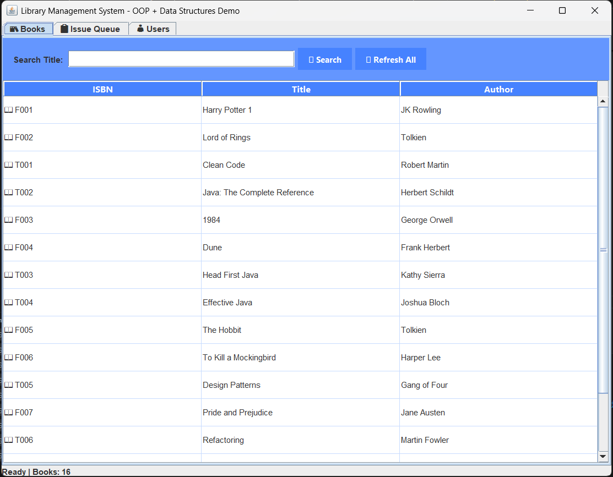

# Library Management System

**Java OOP + Data Structures Mini-Project**  


## Features
- 📚 **Books**: ArrayList/HashMap search + live table
- 📋 **Issue**: Queue (FIFO requests)  
- 👤 **Users**: HashMap + Stack (LIFO undo)

## OOP Demonstrated
- Encapsulation, Inheritance, Abstraction, Polymorphism
- Singleton pattern

## Run
```bash
F5 on MainGUI.java  (VS Code)
# OR
./run.sh
